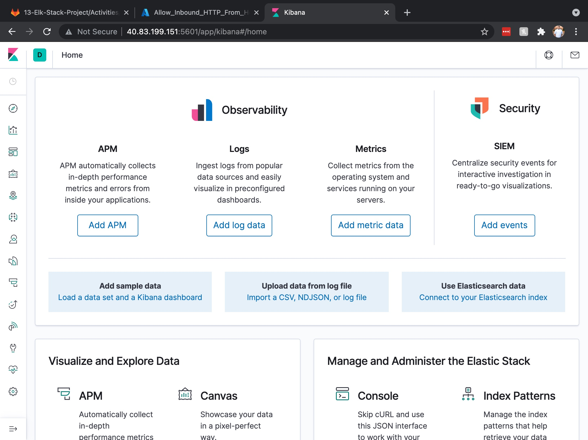

## Automated ELK Stack Deployment

The files in this repository were used to configure the network depicted below.


These files have been tested and used to generate a live ELK deployment on Azure. They can be used to either recreate the entire deployment pictured above. Alternatively, select portions of the yml file may be used to install only certain pieces of it, such as Filebeat.

  - [Ansible Files](/Ansible)

This document contains the following details:
- Description of the Topology
- Access Policies
- ELK Configuration
  - Beats in Use
  - Machines Being Monitored
- How to Use the Ansible Build


### Description of the Topology

The main purpose of this network is to expose a load-balanced and monitored instance of DVWA, the D*mn Vulnerable Web Application.

Load balancing ensures that the application will be highly *available*, in addition to restricting *traffic* to the network.
  - What aspect of security do load balancers protect? 
     - *Load balancers protect the availabilty of resources by distributing network traffic in order to prevent one network from handling too much traffic. Additionally, load balancers check if a web server is up and running before it sends web traffic over, if it is down then it will redirect the traffic.* 
  - What is the advantage of a jump box?
     - *The advantage of a jump box is that security settings only have to be implemented on the jump box rather than implementing it on all machines. Additionally, this allows the network to be hidden behind a single gateway, the jump box.*

Integrating an ELK server allows users to easily monitor the vulnerable VMs for changes to the data and system logs.
- What does Filebeat watch for?
  - Filebeat collects data about the file system and log events.
- What does Metricbeat record?
  - Metricbeat collects machine metrics and statistics, such as uptime.

The configuration details of each machine may be found below.
_Note: Use the [Markdown Table Generator](http://www.tablesgenerator.com/markdown_tables) to add/remove values from the table_.

| Name     | Function | IP Address | Operating System |
|----------|----------|------------|------------------|
| Jump Box | Gateway  | 10.0.0.4   | Linux            |
| Web 1    |Web Server| 10.0.0.5   | Linux            |
| Web 2    |Web Server| 10.0.0.6   | Linux            |
| ELK      |ELK Server| 10.1.0.4   | Linux            |

### Access Policies

The machines on the internal network are not exposed to the public Internet. 

Only the _Elk Server_ machine can accept connections from the Internet. Access to this machine is only allowed from the following IP addresses:
- 104.173.98.15

Machines within the network can only be accessed by the _Jump Box Provisioner_.
- Which machine did you allow to access your ELK VM? What was its IP address?
  - Jump Box Provisioner, 10.0.0.4 (Port 22)
  - Workstation, 104.173.98.15 (Port 5601)

A summary of the access policies in place can be found in the table below.

| Name     | Publicly Accessible | Allowed IP Addresses  |
|----------|---------------------|-----------------------|
| Jump Box | No                  | 104.173.98.15         |
|  Web 1   | No                  | 10.0.0.4              |
|  Web 2   | No                  | 10.0.0.4              |
|Elk Server| No                  |10.0.0.4, 104.173.98.15|

### Elk Configuration

Ansible was used to automate configuration of the ELK machine. No configuration was performed manually, which is advantageous because *instead of manually configuring new machines that are added to the resource group, we can use Ansible to run playbooks that will configure the machines for us. This will save time and effort when expanding a network.*

The playbook ([install-elk](/Ansible/install-elk.yml)) implements the following tasks:
- The first three dashes denote that the file is a YAML file while the rest of the portion specifies which group the playbook will affect:
```
---
- name: Configure Elk VM with Docker
  hosts: elk
  remote_user: azadmin
  become: true
  tasks: 
```
- This portion installs the services noted: docker.io, python3-pip, and docker:
```
    - name: Install docker.io
      apt:
        update_cache: yes
        force_apt_get: yes
        name: docker.io
        state: present

    - name: Install python3-pip
      apt:
        force_apt_get: yes
        name: python3-pip
        state: present

    - name: Install Docker module
      pip:
        name: docker
        state: present
```
- This portion increases the system memory being used:
```
    - name: Increase virtual memory
      command: sysctl -w vm.max_map_count=262144

    - name: Use more memory
      sysctl:
        name: vm.max_map_count
        value: '262144'
        state: present
        reload: yes
```
- This portion downloads the ELK container and publishes the ports that ELK will run through:
```
    - name: download and launch a docker elk container
      docker_container:
        name: elk
        image: sebp/elk:761
        state: started
        restart_policy: always
        # Please list the ports that ELK runs on
        published_ports:
          -  5601:5601
          -  9200:9200
          -  5044:5044
```
- This portion enables docker to launch everytime the VM is booted:
```
    - name: Enable service docker on boot
      systemd:
        name: docker
        enabled: yes
```

The following screenshot displays the result of running `docker ps` after successfully configuring the ELK instance.


### Target Machines & Beats
This ELK server is configured to monitor the following machines:
- Web 1: 10.0.0.5
- Web 2: 10.0.0.6

We have installed the following Beats on these machines:
- Filebeat
- Metricbeat

These Beats allow us to collect the following information from each machine:
- Filebeat monitors log files and collects log events that are indexed by either Elasticsearch or Logstash.
- Metricbeat takes metrics and statistics from the operating system and from the services that are running and forwards the outputs to either Elasticsearch or Logstash.

### Using the Playbook
In order to use the playbook, you will need to have an Ansible control node already configured. Assuming you have such a control node provisioned: 

SSH into the control node and follow the steps below:
- Copy the [ELK](/Ansible/install-elk.yml) YAML file to the ansible container, specifically into /etc/ansible.
- Update the hosts file to include your ELK server, it should resemble the following:
```
 # /etc/ansible/hosts
 [webservers]
 10.0.0.4 ansible_python_interpreter=/usr/bin/python3
 10.0.0.5 ansible_python_interpreter=/usr/bin/python3
 10.0.0.6 ansible_python_interpreter=/usr/bin/python3

 [elk]
 10.1.0.4 ansible_python_interpreter=/usr/bin/python3
```
- Run the playbook (`ansible-playbook install-elk.yml`), and navigate to the ELK server and run `sudo docker ps` to check that the installation worked as expected. If successful, the following should appear:

- Another method of checking that the installation worked as expected would be by navigating to the following: http://[your.ELK-VM.External.IP]:5601/app/kibana

