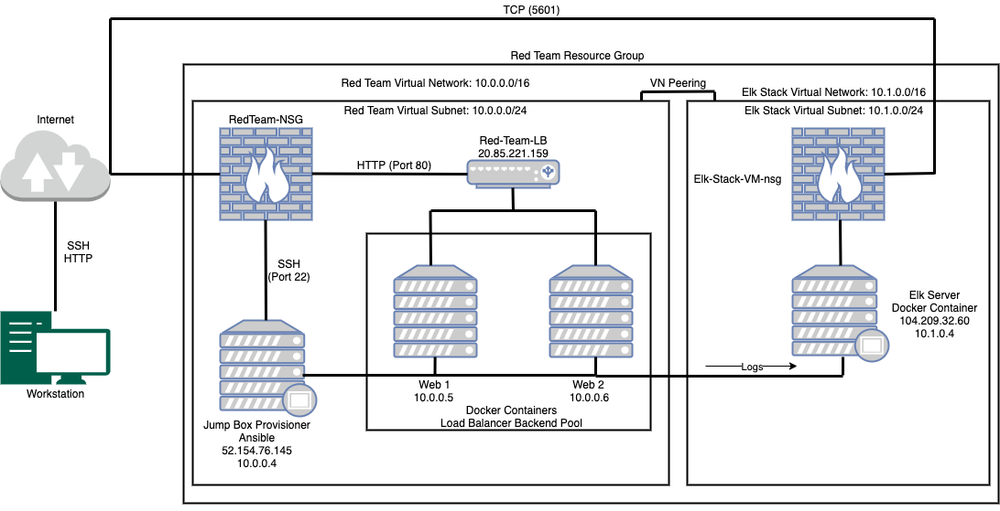

## Automated ELK Stack Deployment

The files in this repository were used to configure the network depicted below.

These files have been tested and used to generate a live ELK deployment on Azure. They can be used to either recreate the entire deployment pictured above. Alternatively, select portions of the yml file may be used to install only certain pieces of it, such as Filebeat.

  - [Ansible Files](/Ansible)

This document contains the following details:
- Description of the Topology
- Access Policies
- ELK Configuration
  - Beats in Use
  - Machines Being Monitored
- How to Use the Ansible Build

### Description of the Topology

The main purpose of this network is to expose a load-balanced and monitored instance of DVWA, the D*mn Vulnerable Web Application.

Load balancing ensures that the application will be highly *available*, in addition to restricting *traffic* to the network.
  - What aspect of security do load balancers protect? 
     - *Load balancers protect the availabilty of resources by distributing network traffic in order to prevent one network from handling too much traffic. Additionally, load balancers check if a web server is up and running before it sends web traffic over, if it is down then it will redirect the traffic.* 
  - What is the advantage of a jump box?
     - *The advantage of a jump box is that security settings only have to be implemented on the jump box rather than implementing it on all machines. Additionally, this allows the network to be hidden behind a single gateway, the jump box.*

Integrating an ELK server allows users to easily monitor the vulnerable VMs for changes to the _____ and system _____.
- What does Filebeat watch for?
  - Filebeat collects data about the file system.
- What does Metricbeat record?
  - Metricbeat collects machine metrics, such as uptime.

The configuration details of each machine may be found below.
_Note: Use the [Markdown Table Generator](http://www.tablesgenerator.com/markdown_tables) to add/remove values from the table_.

| Name     | Function | IP Address | Operating System |
|----------|----------|------------|------------------|
| Jump Box | Gateway  | 10.0.0.4   | Linux            |
| Web 1    |Web Server| 10.0.0.5   | Linux            |
| Web 2    |Web Server| 10.0.0.6   | Linux            |
| ELK      |ELK Server| 10.1.0.4   | Linux            |

### Access Policies

The machines on the internal network are not exposed to the public Internet. 

Only the _Elk Server_ machine can accept connections from the Internet. Access to this machine is only allowed from the following IP addresses:
- 104.173.98.15

Machines within the network can only be accessed by the _Jump Box Provisioner_.
- Which machine did you allow to access your ELK VM? What was its IP address?
  - Jump Box Provisioner, 10.0.0.4 (Port 22)
  - Workstation, 104.173.98.15 (Port 5601)

A summary of the access policies in place can be found in the table below.

| Name     | Publicly Accessible | Allowed IP Addresses  |
|----------|---------------------|-----------------------|
| Jump Box | No                  | 104.173.98.15         |
|  Web 1   | No                  | 10.0.0.4              |
|  Web 2   | No                  | 10.0.0.4              |
|Elk Server| No                  |10.0.0.4, 104.173.98.15|

### Elk Configuration

Ansible was used to automate configuration of the ELK machine. No configuration was performed manually, which is advantageous because...
- _instead of manually configuring new machines that are added to the resource group, we can use the _

The playbook implements the following tasks:
- _TODO: In 3-5 bullets, explain the steps of the ELK installation play. E.g., install Docker; download image; etc._
- ...
- ...

The following screenshot displays the result of running `docker ps` after successfully configuring the ELK instance.

### Target Machines & Beats
This ELK server is configured to monitor the following machines:
- _TODO: List the IP addresses of the machines you are monitoring_

We have installed the following Beats on these machines:
- _TODO: Specify which Beats you successfully installed_

These Beats allow us to collect the following information from each machine:
- _TODO: In 1-2 sentences, explain what kind of data each beat collects, and provide 1 example of what you expect to see. E.g., `Winlogbeat` collects Windows logs, which we use to track user logon events, etc._

### Using the Playbook
In order to use the playbook, you will need to have an Ansible control node already configured. Assuming you have such a control node provisioned: 

SSH into the control node and follow the steps below:
- Copy the _____ file to _____.
- Update the _____ file to include...
- Run the playbook, and navigate to ____ to check that the installation worked as expected.

_TODO: Answer the following questions to fill in the blanks:_
- _Which file is the playbook? Where do you copy it?_
- _Which file do you update to make Ansible run the playbook on a specific machine? How do I specify which machine to install the ELK server on versus which to install Filebeat on?_
- _Which URL do you navigate to in order to check that the ELK server is running?

_As a **Bonus**, provide the specific commands the user will need to run to download the playbook, update the files, etc._
